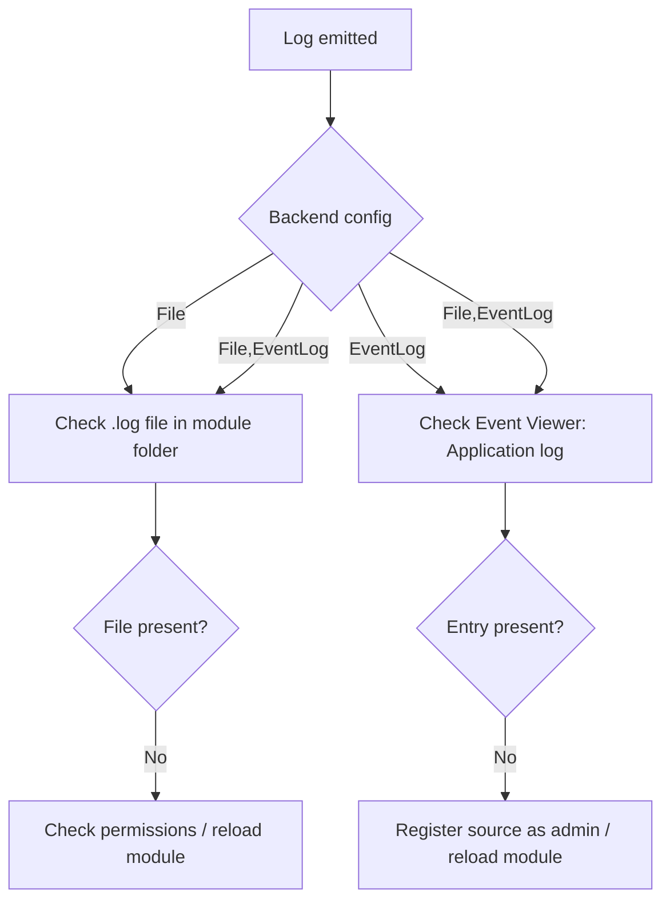

## Logging

The module writes structured logs to one or more configurable backends.
Configure via the app (Configure module → Logging settings) or edit
`ModuleConfig.json` directly.

### Backends

| Value | Where logs go |
|-------|--------------|
| `File` | `LastWarAutoScreenshot.log` in the module directory |
| `EventLog` | Windows Event Log → Application log, source: `LastWarAutoScreenshot` |
| `File,EventLog` | Both simultaneously |

Default: `EventLog`.

```json
"Logging": {
  "Backend": "File,EventLog",
  "MinimumLogLevel": "Info"
}
```

### Log levels

| Level | When it's emitted |
|-------|------------------|
| `Verbose` | Every internal step (noisy; useful during debugging) |
| `Info` | Normal operations and state changes |
| `Warning` | Recoverable issues - something unexpected but non-fatal |
| `Error` | Failures, exceptions, unrecoverable problems |

Set `MinimumLogLevel` to filter out noise. `Warning` is a good default for
production-style runs; `Verbose` when debugging a problem.

### Log file details

- **Location:** Module directory (same folder as the `.psm1`)
- **Filename:** `LastWarAutoScreenshot.log`
- **Format:** JSON — one entry per line, easy to parse or `grep`
- **Rollover:** Configurable by size (`MaxSizeMB`), count (`MaxFileCount`),
  and age (`MaxAgeDays`) — see [Configuration.md](Configuration.md)

To test logging from a PowerShell session:

```powershell
Import-Module .\LastWarAutoScreenshot\LastWarAutoScreenshot.psd1
Write-LastWarLog -Message "Test entry" -ErrorType Info -FunctionName "Test"
```

### Windows Event Log registration

Writing to the Application log requires the source `LastWarAutoScreenshot`
to be registered. This is a one-time operation and requires admin rights.

```powershell
# Run once in an elevated session
New-EventLog -LogName Application -Source "LastWarAutoScreenshot"
```

After registration, normal (non-admin) operation is fine. Once the source
exists, any user can write to it.

To view entries: open Event Viewer (`eventvwr.msc`) → Windows Logs →
Application → filter by Source: `LastWarAutoScreenshot`.

**Non-admin note:** If the source hasn't been registered you'll see a warning
like:

```
WARNING: Failed to write log entry via EventLog backend: The source was not found...
```

This is harmless - the module falls back to file logging. Register the source
(admin, once) to silence it.

### Troubleshooting

**No log file appears**

- Confirm `Logging.Backend` is set to `File` or `File,EventLog`
- Check write permissions on the module directory
- Run as admin if you see access denied errors

**No Event Log entries**

- Confirm `Logging.Backend` is `EventLog` or `File,EventLog`
- Run `New-EventLog -LogName Application -Source "LastWarAutoScreenshot"` in
  an elevated session if the source is not registered
- After changing the backend, reload the module:
  `Import-Module .\LastWarAutoScreenshot.psd1 -Force`

**After changing `MinimumLogLevel`, nothing changes**

- The config is read on module load. Reload with `-Force` or restart
  your PowerShell session.

**Flowchart: which backend am I hitting?**



