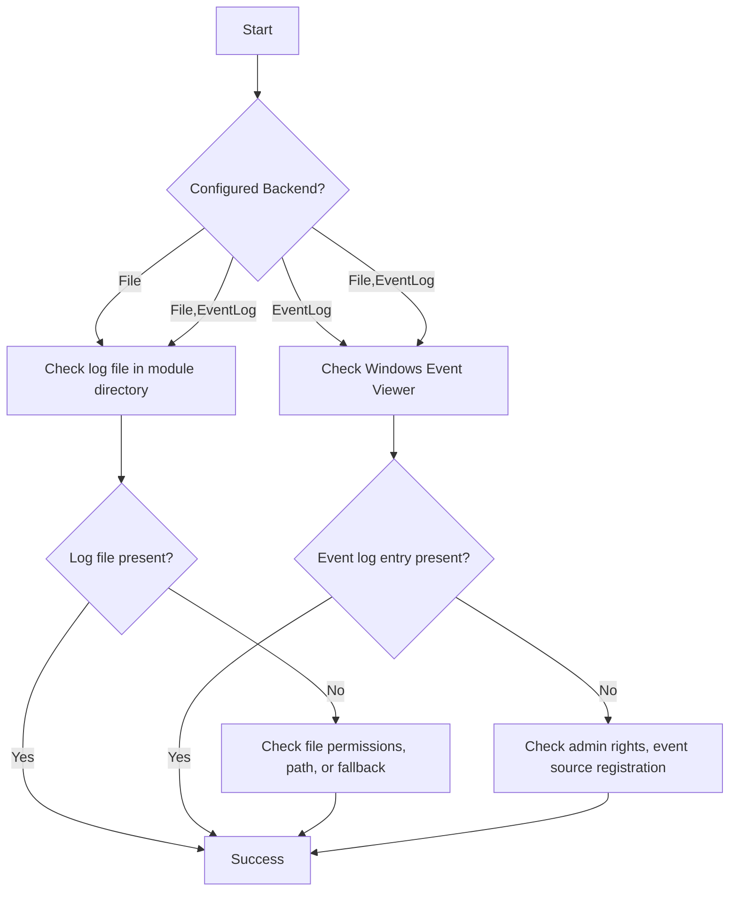

## Audience and Documentation Style

- **Quick tips and practical steps:** Every section includes actionable advice, not just theory.
- **Gamer context:** Examples reference game automation scenarios, such as logging mouse actions, window events, and emergency stops.
- **Developer context:** All PowerShell code is ready to copy-paste, and troubleshooting guides are written for users comfortable with scripting and Windows tools.
- **Visuals and walkthroughs:** Diagrams, screenshots, and flowcharts are included to make setup and troubleshooting as clear as possible.

If you have suggestions for making the docs more gamer-friendly or developer-focused, please contribute or open an issue!

## Step-by-Step Walkthroughs and Visual Guides

### 1. Configuring Logging Backend (Step-by-Step)

**Step 1:** Open your module configuration file (`ModuleConfig.json`).

**Step 2:** Locate or add the `Logging` section. Set the `Backend` key to your desired value:

| Backend Value      | Description                                 |
|--------------------|---------------------------------------------|
| File               | Log to local file only                      |
| EventLog           | Log to Windows Event Log only (default)     |
| File,EventLog      | Log to both file and Event Log              |

**Step 3:** Save the file and reload the module or restart your PowerShell session.

**Step 4:** (Optional) Test logging with:

```powershell
Write-LastWarLog -Message "Test log entry" -ErrorType Info -FunctionName "TestFunction"
```

**Step 5:**

- For file logging: Open `LastWarAutoClickScreenshot.log` in the module directory.
- For Event Log: Open Windows Event Viewer (`eventvwr.msc`), go to Application log, and filter by Source: `LastWarAutoScreenshot`.

---

### 2. Visual Guide: Logging Backend Configuration Example


*Example: Setting Logging.Backend to File,EventLog in ModuleConfig.json*

---

### 3. Troubleshooting Logging Issues (Flowchart)



---

### 4. Screenshot: Windows Event Viewer (Application Log)


*Example: Viewing LastWarAutoScreenshot logs in Windows Event Viewer*

## Event Log Source Registration and Permissions

### Overview

To write to the Windows Event Log, the module must register an event source named `LastWarAutoScreenshot`. This is required for logging to the Application log and is typically handled automatically by the module on first use.

### User vs. Admin Install Scenarios

- **Admin Install (Recommended):**
  - Registering the event source requires Administrator privileges.
  - If you install or run the module as Administrator, the event source will be registered automatically and logging to the Event Log will work without issues.
  - To manually register the event source, run:

    ```powershell
    New-EventLog -LogName Application -Source "LastWarAutoScreenshot"
    ```

    (Run this in an elevated PowerShell session.)

- **User Install (Non-Admin):**
  - If you run the module without Administrator privileges, the event source may not be registered.
  - The module will attempt to log to the Event Log, but if registration fails, it will fall back to file logging and may display a warning.
  - You may see errors or warnings about event source registration in the console or log file.
  - To enable Event Log logging as a non-admin user, ask your system administrator to register the event source for you.

### Troubleshooting

- If you see errors about event source registration or missing permissions:
  - Run PowerShell as Administrator and try again.
  - Check the Application log in Windows Event Viewer for related errors.
  - If you cannot obtain admin rights, use file logging instead by setting `Logging.Backend` to `File` in your configuration.

### Security Note

Registering an event source is a one-time operation per machine. Once registered, any user can write to the Application log using that source.

## Troubleshooting Logging Issues

### Default Logging Behaviour

By default, the module logs to the Windows Event Log only. Local file logging is used only if you explicitly configure it in your module configuration, or if there is a problem writing to the Windows Event Log (such as missing permissions or registration errors). If you want logs to be written to a local file, set `Logging.Backend` to `File` or `File,EventLog` in your configuration. If the module cannot write to the Event Log, it will automatically fall back to file logging and may display a warning.

### Permissions Errors

- **File Logging:**
  - If the log file cannot be created or written, ensure you have write permissions to the module directory.
  - Try running PowerShell as Administrator if you encounter access denied errors.
  - Check if the log file is locked by another process.
- **Windows Event Log:**
  - Writing to the Windows Event Log may require Administrator privileges, especially when registering the event source for the first time.
  - If you see errors about event source registration, run PowerShell as Administrator and try again.
  - If logging fails silently, check the Application log in Windows Event Viewer for related errors.

### Log File Locations

- **File Backend:**
  - Log file: `LastWarAutoClickScreenshot.log`
  - Default location: The same directory as the module (typically `src/LastWarAutoClickScreenshot/`)
  - You can open this file with any text editor or JSON viewer.
- **Event Log Backend:**
  - Log entries are written to the Windows Event Log (Application log, source: `LastWarAutoScreenshot`).
  - View logs using Windows Event Viewer: `eventvwr.msc` > Windows Logs > Application > Source: LastWarAutoScreenshot

### Backend Selection Issues

- If you do not see logs where expected:
  - Double-check the `Logging.Backend` value in your configuration file. Valid values: `File`, `EventLog`, `File,EventLog`.
  - If the value is missing or invalid, file logging is used by default.
  - After changing the backend, restart your PowerShell session or reload the module to apply changes.
  - For Event Log issues, ensure you have the necessary permissions and that the event source is registered.

## PowerShell Command-Line Usage Examples for Logging Backends

Below are example PowerShell commands for configuring and using the logging backends. These examples assume you have the module imported and are running in a PowerShell 7+ session.

### Set Logging Backend to File Only

Update your configuration to use only file logging:

```powershell
# Update Logging.Backend to 'File' in your ModuleConfig.json
$config = Get-Content -Raw -Path "./src/LastWarAutoClickScreenshot/private/ModuleConfig.json" | ConvertFrom-Json
$config.Logging.Backend = "File"
$config | ConvertTo-Json -Depth 5 | Set-Content -Path "./src/LastWarAutoClickScreenshot/private/ModuleConfig.json"
```

### Set Logging Backend to Windows Event Log Only

```powershell
# Update Logging.Backend to 'EventLog' in your ModuleConfig.json
$config = Get-Content -Raw -Path "./src/LastWarAutoClickScreenshot/private/ModuleConfig.json" | ConvertFrom-Json
$config.Logging.Backend = "EventLog"
$config | ConvertTo-Json -Depth 5 | Set-Content -Path "./src/LastWarAutoClickScreenshot/private/ModuleConfig.json"
```

### Enable Both File and Event Log Backends

```powershell
# Update Logging.Backend to 'File,EventLog' in your ModuleConfig.json
$config = Get-Content -Raw -Path "./src/LastWarAutoClickScreenshot/private/ModuleConfig.json" | ConvertFrom-Json
$config.Logging.Backend = "File,EventLog"
$config | ConvertTo-Json -Depth 5 | Set-Content -Path "./src/LastWarAutoClickScreenshot/private/ModuleConfig.json"
```

### Test Logging Output

You can trigger a test log entry using the module's logging function (replace with the actual exported function if different):

```powershell
Import-Module ./src/LastWarAutoClickScreenshot/LastWarScreenshot.psm1
Write-LastWarLog -Message "Test log entry" -ErrorType Info -FunctionName "TestFunction"
```

Check the log file (`LastWarAutoClickScreenshot.log`) in the module directory or the Windows Event Viewer (under Application log, source: LastWarAutoScreenshot) to verify the entry.

# Logging Standard for LastWarAutoScreenshot

## Where and How Logging Occurs

- **File Logging:** All error and event logs are written to `LastWarAutoClickScreenshot.log` in the module directory. Log entries are in JSON format for easy parsing and analysis.
- **Windows Event Logging:** Critical errors and diagnostic events may also be written to the Windows Event Log (requires admin privileges). Viewable in Windows Event Viewer.
- **Console Output:** User-facing errors and warnings are displayed in plain text for immediate feedback.

## Logging Backend Options and Configuration Keys

The logging system supports multiple backends, which can be enabled individually or together. The backend(s) are selected using the `Logging.Backend` configuration key in your module configuration file (ModuleConfig.json).

### Supported Backends

- **File**: Logs are written to a local file (`LastWarAutoClickScreenshot.log`) in the module directory. This is the default if no backend is specified.
- **EventLog**: Logs are written to the Windows Event Log (requires appropriate permissions; see troubleshooting for details).
- **File,EventLog**: Both file and Windows Event Log backends are enabled. Logs are written to both destinations.

### Configuration Key

- **Key**: `Logging.Backend`
- **Type**: String (comma-separated list)
- **Valid Values**: `File`, `EventLog`, `File,EventLog`
- **Default**: `File` (if missing or invalid)

#### Example Configuration

```json
{
  "Logging": {
    "Backend": "File,EventLog"
  }
}
```

#### To log only to file

```json
{
  "Logging": {
    "Backend": "File"
  }
}
```

#### To log only to Windows Event Log

```json
{
  "Logging": {
    "Backend": "EventLog"
  }
}
```

If the configuration key is missing or contains an invalid value, file logging will be used by default.

---

## Logging Levels and Configuration

- **Verbosity Levels:**
  - `Info`: Standard operations and successful events.
  - `Warning`: Recoverable issues, unexpected but non-fatal conditions.
  - `Error`: Failures, exceptions, or unrecoverable problems.
- **Debug Mode:**
  - When run with `-Debug` or `-Verbose`, all operations and internal state changes are logged for troubleshooting.
  - Debug mode includes all relevant variables and context in error log events.
- **Configuration:**
  - Verbosity level is configurable via command-line parameters or the GUI "Logging" tab.
  - **Logging backend selection is controlled by the module configuration file** (`ModuleConfig.json`).
  - The `Logging.Backend` property determines which backends are used. Supported values: `File`, `EventLog`, or both (comma-separated).

### Example: ModuleConfig.json

```json
{
  "Logging": {
    "Backend": "File,EventLog"
  }
}
```

- To log only to file:

  ```json
  { "Logging": { "Backend": "File" } }
  ```

- To log only to Windows Event Log:

  ```json
  { "Logging": { "Backend": "EventLog" } }
  ```

- If the config or property is missing/invalid, file logging is used by default.

## What Gets Logged

- **All operations** (in debug/verbose mode): Function calls, parameters, and state changes.
- **Errors and exceptions:** Always logged with full context, stack trace, and error type.
- **Warnings:** Unexpected but non-fatal issues, such as recoverable API failures.
- **User actions:** Emergency stops, configuration changes, and critical user-triggered events.
- **Mid-sequence failures:** All failures during automation are logged with full context; retry logic is also logged.
- **Window crashes/closes:** Detected and logged; sequence aborts gracefully with error event.
- **Upload/storage failures:** Exponential backoff and retry attempts are logged.
- **Emergency stops:** All emergency stops (hotkey or mouse gesture) are logged for audit purposes.

## Standard Logging Format

# Logging Standard for LastWarAutoScreenshot

## Purpose

All log entries must include the following fields:

| Field           | Description                                      | Example                        |
|-----------------|--------------------------------------------------|--------------------------------|
| Timestamp       | UTC time of the event (ISO 8601)                 | 2026-02-15T14:23:01Z           |
| FunctionName    | Name of the function where the log is generated  | Get-EnumeratedWindows          |
| ErrorType       | Type/category of error (e.g., Exception, Warning)| Exception                      |
| Message         | Error or event message                           | Failed to enumerate windows     |
| Context         | Key context info (parameters, state, etc.)       | WindowHandle=0x001A02          |
| StackTrace      | (If error) Call stack at the time of error       | ...                            |

### Example Log Entry (JSON)

```json
{
  "Timestamp": "2026-02-15T14:23:01Z",
  "FunctionName": "Get-EnumeratedWindows",
  "ErrorType": "Exception",
  "Message": "Failed to enumerate windows",
  "Context": "WindowHandle=0x001A02",
  "StackTrace": "at Get-EnumeratedWindows..."
}
```

### Example Log Entry (Plain Text)

```
```

## Implementation Guidance

- Use the logging helper function for all error/event logs.
- Always include all required fields.
- Prefer JSON format for logs written to file or external systems.
- Use plain text for console/user-facing logs if preferred.
- See the table above for what is logged at each level.

## Updating the Logging Helper

- Add inline comments to clarify field usage for future maintainers.

## References

- See README.md for a summary and quick reference.
- For implementation, see `src/LastWarAutoClickScreenshot/private/Write-LastWarLog.ps1`.
